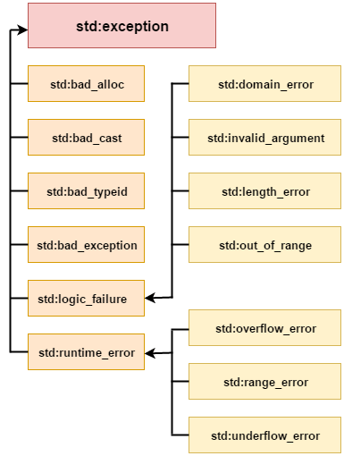

# Error Handling

## `Try`, `Catch` and `Throw`

```cpp
#include <iostream>
#include <exception>
using namespace std;

int main()
{
    int a = 10;
    int b = 0;
    try
    {#include <iostream>
#include <exception>
using namespace std;

int main()
{
    int a = 10;
    int b = 0;
    try
    {
        if(b==0)
        {
            throw "Division by zero";
        }
        int c = a / b;
    }
    catch (const char *e)
    {
        cerr << "Exception occurred: " << e << endl;
    }
    return 0;
}
        if(b==0)
        {
            throw "Division by zero";
        }
        int c = a / b;
    }
    catch (const char *e)
    {
        cerr << "Exception occurred: " << e << endl;
    }
    return 0;
}
```

---

## `Catching` different types of exceptions & all `remaining exceptions`

```cpp
#include <iostream>
#include <stdexcept>
using namespace std;

int main()
{
    int a = 10;
    int b = 0;
    try
    {
        if (b == 0)
        {
            throw "Division by zero";
        }
        if (b == 1)
        {
            throw 1;
        }
        if (b == 2)
        {
            throw runtime_error("Division by zero");
        }
        int c = a / b;
    }
    catch (const char *e)
    {
        cerr << "Exception occurred with char*: " << e << endl;
    }
    catch (const int e)
    {
        cerr << "Exception occurred with int: " << e << endl;
    }
    catch (...) // catch all remaining exceptions
    {
        cout << "Exception occurred with unknown type" << endl;
    }
    return 0;
}
```

---

## Exception types

- C++ provides standard exception and an Exception class that can be used to create custom exceptions.
- C++ provides two types of exceptions:
    - Standard exceptions (`stdexcept` header) (also available with `std::runtime_error`)
        - Logical errors
        - Runtime errors
    - Exception classes (`exception` header)
        - Custom exceptions



---

## Throwing a runtime error

- Use `stdexpect` header to bring in the `runtime_error` class.
- Use `throw` keyword to throw an exception.
- Use `what()` method to get the error message.

```cpp
# include <iostream>
# include <stdexcept>
using namespace std;

int main()
{
    int a = 10;
    int b = 0;
    try
    {
        if(b==0)
        {
            throw runtime_error("Division by zero");
        }
        int c = a / b;
    }
    catch (runtime_error e)
    {
        cerr << "Exception occurred: " << e.what() << endl;
    }
    return 0;
}
```

---

## Throwing a custom exception

- Use `exception` header to bring in the `exception` class.
- Use `throw` keyword to throw an exception.
- Override the `what()` method to get the error message.

```cpp
# include <iostream>
# include <exception>
using namespace std;

class MyException : public exception
{
    public:
        MyException(string msg) : msg(msg) {}
        const char* what() const throw(const char*)
        {
            return msg.c_str();
        }
    private:
        string msg;
};

int main()
{
    int a = 10;
    int b = 0;
    try
    {
        if(b==0)
        {
            throw MyException("Division by zero");
        }
        int c = a / b;
    }
    catch (MyException e)
    {
        cerr << "Exception occurred: " << e.what() << endl;
    }
    return 0;
}
```

---

## `Rethrow` an exception

- Use `throw` keyword to **rethrow** an exception.

- Rethrowing an exception in C++ involves catching an exception within a try block and instead of dealing with it locally throwing it again to be caught by an outer catch block. By doing this. we preserve the type and details of the exception ensuring that it can be handled at the appropriate level within our program.

> This approach becomes particularly valuable when managing exceptions at multiple levels or when additional actions need to be performed before resolving the exception.

```cpp
#include <iostream>
#include <stdexcept>
using namespace std;

// Function to perform division
int divide(int numerator, int denominator)
{
    try
    {
        if (denominator == 0)
        {
            // Throw a runtime_error if attempting to divide
            // by zero
            throw runtime_error("Division by zero!");
        }
        // Perform the division and return the result
        return numerator / denominator;
    }
    catch (const exception &e)
    {
        cout << "Caught exception in divide(): " << e.what() << endl;
        // Rethrow the caught exception to handle it at a
        // higher level
        throw;
    }
}

// Function to calculate the sum of two numbers
int calculateSum(int a, int b)
{
    try
    {
        if (a < 0 || b < 0)
        {
            // Throw an invalid_argument exception for
            // negative numbers
            throw invalid_argument(
                "Negative numbers not allowed!");
        }
        // Calculate and return the sum
        return a + b;
    }
    catch (const exception &e)
    {
        cout << "Caught exception in calculateSum(): " << e.what() << endl;
        // Rethrow the caught exception to handle it at a
        // higher level
        throw;
    }
}

int main()
{
    try
    {
        // Calculate the sum of 10 and the result of
        // dividing 20 by 2
        int result = calculateSum(10, divide(20, 2));
        cout << "Result: " << result << endl;

        // Attempt to divide by zero, triggering an
        // exception
        int invalidResult = calculateSum(5, divide(10, 0));
        cout << "Invalid Result: " << invalidResult << endl;
    }
    catch (const exception &e)
    {
        cout << "Caught exception in main: " << e.what() << endl;
        // Handle the exception at the highest level
    }

    return 0;
}
```
